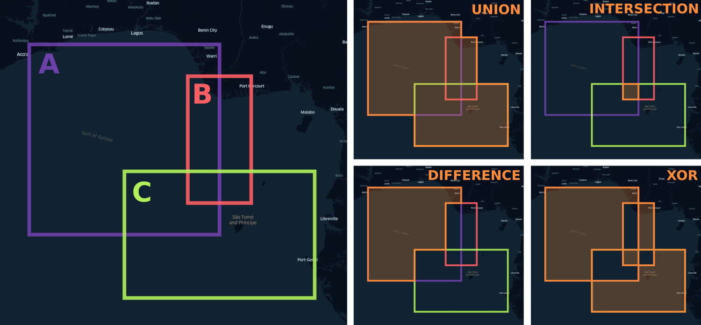

# polygol

Boolean polygon clipping/overlay operations (union, intersection, difference, xor) on Polygons and MultiPolygons. A pure Go port of the [mfogel/polygon-clipping](https://github.com/mfogel/polygon-clipping) JS library.

## Quickstart

```go
A := [][][][]float64{{{{0.0, 0.0}, {0.0, 6.0}, {6.0, 6.0}, {6.0, 0.0}, {0.0, 0.0}}}}
B := [][][][]float64{{{{5.0, 1.0}, {5.0, 5.0}, {7.0, 5.0}, {7.0, 1.0}, {5.0, 1.0}}}}
C := [][][][]float64{{{{3.0, -2.0}, {3.0, 2.0}, {9.0, 2.0}, {9.0, -2.0}, {3.0, -2.0}}}}

union, _ := polygol.Union(A, B, C)
intersection, _ := polygol.Intersection(A, B, C)
difference, _ := polygol.Difference(A, B, C)
xor, _ := polygol.XOR(A, B, C)
```



## API

```polygol``` only has a single type ```Geom``` that represents a MultiPolygon:

```go
type Geom [][][][]float64
```

Each of the Boolean operations (union, intersection, difference and XOR) take in one subject ```Geom``` and any number of clipping ```Geom```'s:

```go
func polygol.Union(geom polygol.Geom, moreGeoms ...polygol.Geom) (polygol.Geom, error)
```

## Examples

The [examples](https://github.com/engelsjk/polygol/tree/main/examples) page includes some information on how ```polygol``` can interface with Go geometry libraries like [paulmach/go.geojson](https://github.com/paulmach/go.geojson), [paulmach/orb](https://github.com/paulmach/orb) and [twpayne/go-geom](https://github.com/twpayne/go-geom).

## Test Coverage

At the moment, ```polygol``` aims to have 100% test coverage relative to [polygon-clipping](https://github.com/mfogel/polygon-clipping); all unit and end-to-end tests have been ported over to Go.

## Dependencies

```polygol``` only has a single dependency: [engelsjk/splay-tree](https://github.com/engelsjk/splay-tree/). This is a Go port of the JS library [w8r/splay-tree](https://github.com/w8r/splay-tree) which is used in [polygon-clipping](https://github.com/mfogel/polygon-clipping). BST splay trees are used for the coordinate rounder, the sweep event priority queue and the sweep line itself.

## Why ```polygon-clipping```?

The [polygon-clipping](https://github.com/mfogel/polygon-clipping) library is a well-tested implementation of the Martínez-Rueda-Feito algorithm and is also currently used behind-the-scenes in both TurfJS and the OpenStreetMap iD editor. Naively porting this library to Go is intended to provide a simple but robust polygon clipping capability in Go without the need for [GEOS](https://trac.osgeo.org/geos) bindings. Future improvements to ```polygol``` may include algorithm restructuring, better memory management and built-in interfaces to common Go geometry libraries.

## Performance

The Martínez-Rueda-Feito polygon clipping algorithm computes the Boolean operations in ```O((n+k)*log(n))``` time, where ```n``` is the total number of edges of all polygons and ```k``` is the number of intersections between edges.

## References

The algorithm implemented here and in [polygon-clipping](https://github.com/mfogel/polygon-clipping) is based on the following paper:

[*A new algorithm for computing Boolean operations on polygons*](https://github.com/mfogel/polygon-clipping/blob/master/paper.pdf) by Francisco Martínez, Antonio Jesus Rueda, Francisco Ramon Feito (2009)

Additional information can also be found in the follow-up paper:

[*A simple algorithm for Boolean operations on polygons*](https://www.sciencedirect.com/science/article/abs/pii/S0965997813000379) by Francisco Martínez, Carlos Ogayar, Juan R. Jiménez and Antonio J. Rueda (2013)
